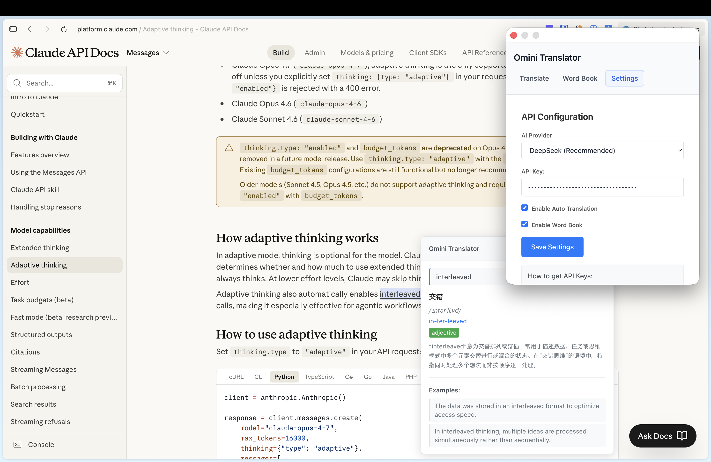
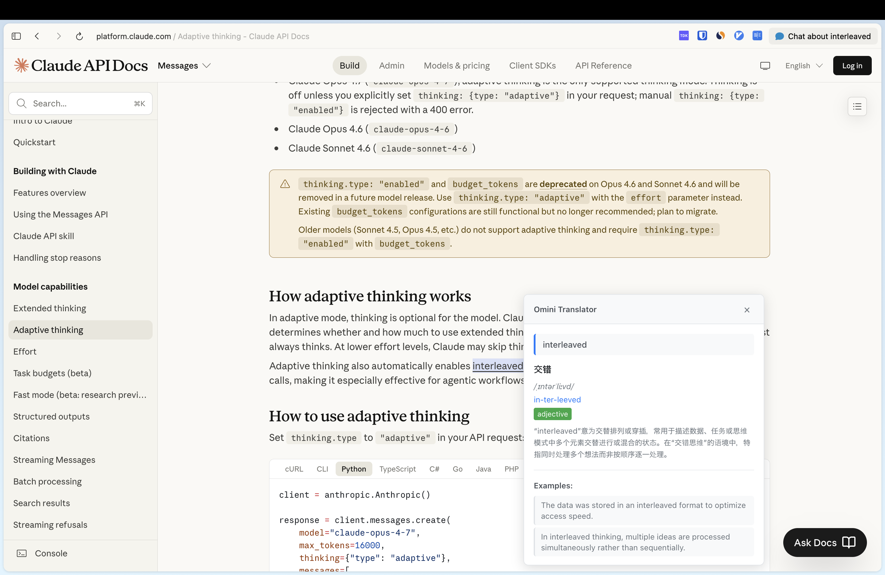
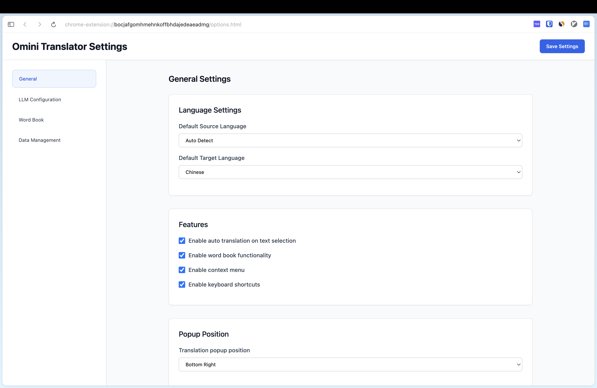
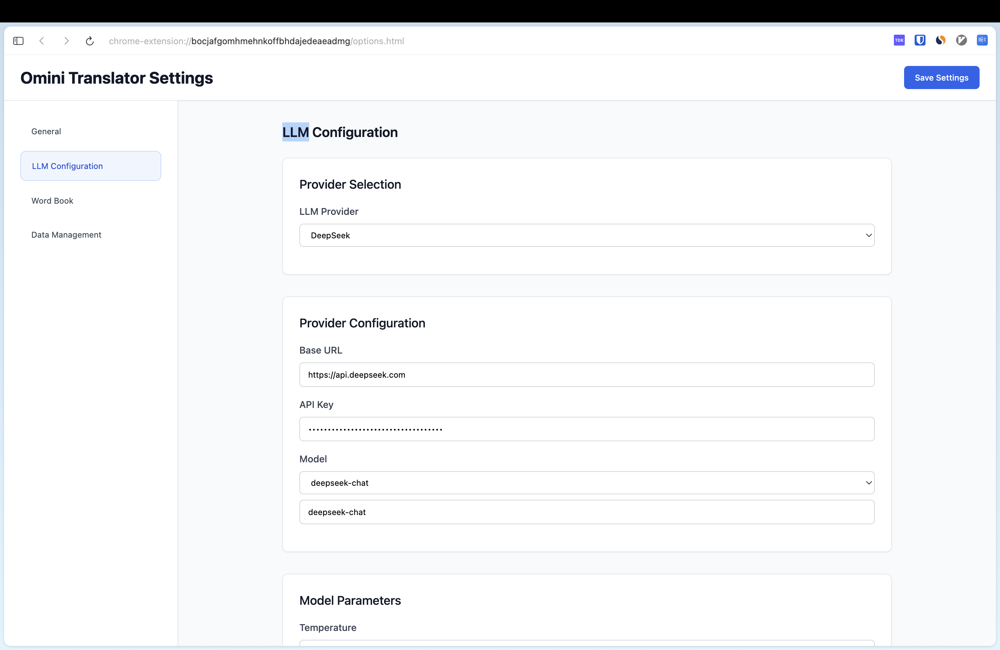
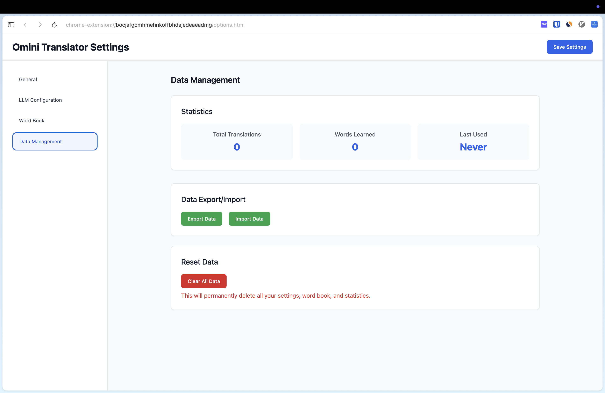

# Omini Translator - AI 智能翻译助手

> 一款基于大语言模型的浏览器翻译插件，支持选词翻译、自动翻译、单词本等多种功能。


## 📸 效果展示







## ✨ 核心功能

### 🤖 AI 驱动翻译
- 支持 7 家主流 LLM 提供商（OpenAI、Claude、DeepSeek、Kimi、GLM、Qwen、MiniMax）
- 智能识别语境，提供专业准确的翻译
- 自动检测源语言，无需手动选择

### 📝 选词翻译
- 鼠标选中文本即可自动翻译
- 翻译弹窗显示在选中文本附近，不打断阅读体验
- 支持自定义弹窗位置（左上/右上/左下/右下）

### 📚 单词本
- 一键保存生词到单词本
- 支持发音、音标、词性、例句、用法解释
- 记录源语言例句，帮助理解用法

### ⌨️ 快捷键支持
- `Ctrl+T` / `Cmd+T` - 翻译选中文本
- `Ctrl+B` / `Cmd+B` - 打开单词本
- `Ctrl+Shift+T` - 全文翻译（开发中）

### 🌍 多语言支持
支持 15 种语言互译：
- 自动检测、英语、中文、日语、韩语
- 法语、德语、西班牙语、意大利语、葡萄牙语
- 俄语、阿拉伯语、印地语、泰语、越南语

## 📦 安装方法

### 开发者模式安装

1. 克隆或下载本项目
```bash
git clone https://github.com/yourusername/omini-translator.git
cd omini-translator
```

2. 安装依赖并构建
```bash
npm install
npm run build
```

3. 打开 Chrome 扩展管理页面
   - 地址栏输入 `chrome://extensions/`
   - 开启右上角的"开发者模式"
   - 点击"加载已解压的扩展程序"
   - 选择 `dist` 文件夹

4. 固定扩展图标（可选）
   - 点击 Chrome 工具栏的扩展图标
   - 点击 Omini Translator 旁边的图钉图标

## ⚙️ 配置说明

### 首次使用配置

1. 点击扩展图标，选择"Options"或右键扩展图标选择"选项"
2. 进入"LLM Configuration"标签页
3. 选择你喜欢的 LLM 提供商
4. 填写 API Key 和模型名称
5. 点击"Save Settings"保存

### 支持的 LLM 提供商

| 提供商 | 官网 | 推荐模型 |
|--------|------|----------|
| **OpenAI** | https://openai.com | gpt-4o-mini, gpt-4o |
| **Claude** | https://anthropic.com | claude-sonnet-4-7 |
| **DeepSeek** | https://deepseek.com | deepseek-chat |
| **Kimi** | https://moonshot.cn | kimi-k2.5 |
| **GLM** | https://zhipuai.cn | glm-4-plus |
| **Qwen** | https://tongyi.aliyun.com | qwen-max |
| **MiniMax** | https://minimaxi.com | MiniMax-Text-01 |

### 获取 API Key

- **OpenAI**: https://platform.openai.com/api-keys
- **Claude**: https://console.anthropic.com/settings/keys
- **DeepSeek**: https://platform.deepseek.com
- **Kimi**: https://platform.moonshot.cn
- **GLM**: https://open.bigmodel.cn
- **Qwen**: https://dashscope.aliyun.com
- **MiniMax**: https://platform.minimaxi.com

## 🚀 使用指南

### 选词翻译

1. 在任意网页上选中要翻译的文本（单词或短语）
2. 松开鼠标，翻译弹窗会自动出现在选中文本附近
3. 弹窗显示：翻译结果 + 发音/音标 + 例句 + 用法解释

### 保存到单词本

1. 在翻译弹窗中点击"Save to Word Book"按钮
2. 单词会保存到单词本，包含完整上下文
3. 在扩展选项页的"Word Book"标签页查看所有保存的单词

### 语音朗读

点击翻译弹窗中的"Speak"按钮，可朗读翻译结果。

### 自定义设置

进入扩展选项页，可以配置：
- **语言设置**: 默认源语言和目标语言
- **功能开关**: 自动翻译、单词本、快捷键等
- **弹窗位置**: 选择翻译弹窗显示位置
- **模型参数**: 温度、最大token数等

## 🛠️ 开发

### 技术栈

- **React 18** + TypeScript - 选项页和弹窗 UI
- **Webpack 5** - 构建工具
- **Tailwind CSS** - 样式框架
- **Chrome Extension Manifest V3** - 扩展架构

### 项目结构

```
omini-translator/
├── src/
│   ├── background/        # 后台服务脚本
│   ├── content/           # 内容脚本（页面注入）
│   ├── options/           # 选项页
│   ├── popup/             # 工具栏弹窗
│   ├── services/          # LLM 服务实现
│   ├── types/             # TypeScript 类型定义
│   └── utils/             # 工具函数
├── dist/                  # 构建输出目录
├── manifest.json          # 扩展清单
└── package.json
```

### 开发命令

```bash
# 开发模式（自动监视变化）
npm run dev

# 生产构建
npm run build

# 代码检查
npm run lint

# 类型检查
npm run type-check

# 清理构建目录
npm run clean
```

### 加载开发版本

1. 运行 `npm run dev` 启动开发模式
2. 在 Chrome 扩展管理页面加载 `dist` 文件夹
3. 修改代码后自动重新构建，在扩展页面点击刷新即可

## 🔒 隐私说明

- 本扩展仅在本地存储你的设置和单词本数据
- API Key 存储在 Chrome 的本地存储中，不会上传到任何服务器
- 翻译文本仅发送给你配置的 LLM 提供商

## 📝 更新日志

### v1.0.0
- ✨ 首次发布
- 🤖 支持 7 家 LLM 提供商
- 📝 选词翻译功能
- 📚 单词本功能
- ⌨️ 快捷键支持
- 🌍 支持 15 种语言

## 🤝 贡献

欢迎提交 Issue 和 Pull Request！

## 📄 许可证

MIT License © 2024 Omini Translator

---

> 如果这个项目对你有帮助，请给个 ⭐️ 支持一下！
